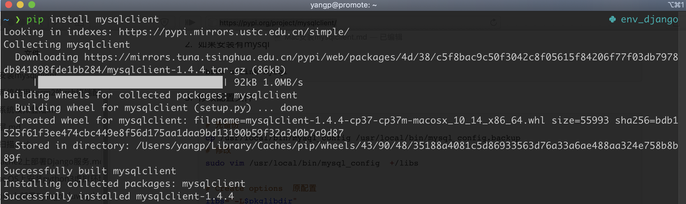

# 使用[mysqlclient](https://pypi.org/project/mysqlclient/)的推荐安装方式

1. 使用homebrew安装mysql-connector-c

   ```bash
   brew install mysql-connector-c
   ```

2. 如果安装有mysql

   ```bash
   brew unlink mysql
   ```

3. 修改配置文件

   ```bash
   # 先备份
   cp /usr/local/bin/mysql_config /usr/local/bin/mysql_config.backup
   # 修改
   sudo vim /usr/local/bin/mysql_config  +/libs

   # Create options  原配置
   libs="-L$pkglibdir"
   libs="$libs -l "

   # Create options 修改为
   libs="-L$pkglibdir"
   libs="$libs -lmysqlclient -lssl -lcrypto"

   ```

4. 链接openssl

   ```bash
   brew install openssl # 一般已经安装
   export LIBRARY_PATH=$LIBRARY_PATH:/usr/local/opt/openssl/lib/
   ```

5. 安装mysqlclient

   ```bash
   pip3 install mysqlclient
   ```

   
