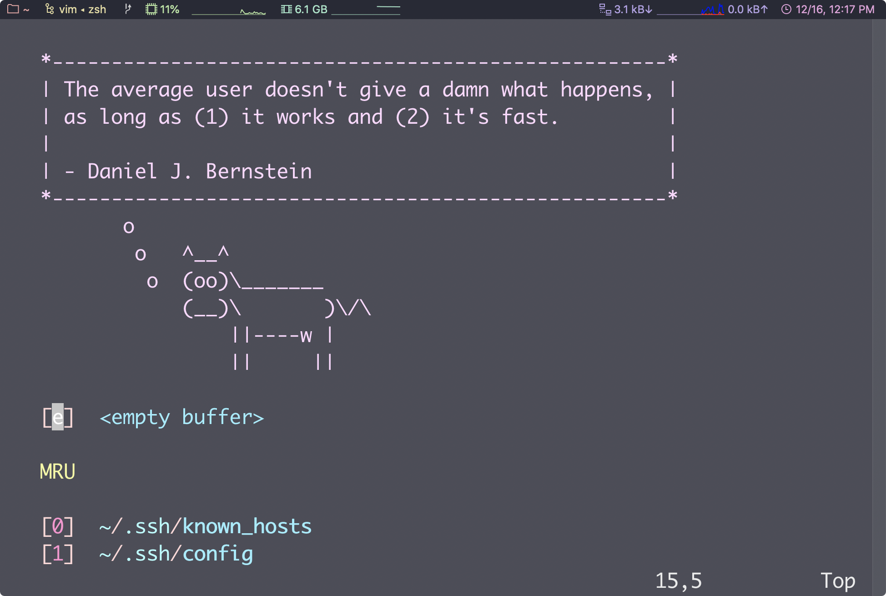

# vim配置

1. 主要配置使用Python3、C、C++等

2. 实现python3脚本运行，以及c、cpp的编译运行

## vim快捷键

1. vim的模式，命令行模式，插入模式，视图模式
2. 常用命令
    1. 插入、保存、退出、强制
    2. 视图模式选择
    3. dd 删除单行
    4. p 粘贴
    5. y 复制
    6. G 转到最后一行
    7. gg转到第一行
    8. o 在下一行插入
    9. w 通过空格确定单词
    10. 方向键 hjkl
    11. v 进入视图模式
3. 组合命令
    1. ggvG 全选
4. vim跳转命令
    1. 跳转到行首^,行尾$
    2. 下一个单词首w,尾e,前一个单词b
5. 视图模式
    1. 添加选定视图的内容到系统剪切板 :w !pbcopy
    2. 从系统剪切板粘贴内容:r !pbpaste
    3. 拷贝整个文件:%w !pbcopy
    4. 使用vim的寄存器剪切 复制y,粘贴p
    5. v,视图模式,crtl+v 行视图,shift+v 列视图
    6. 在视图模式下也可以使用各种跳转命令(也许有特例,没事试过)
