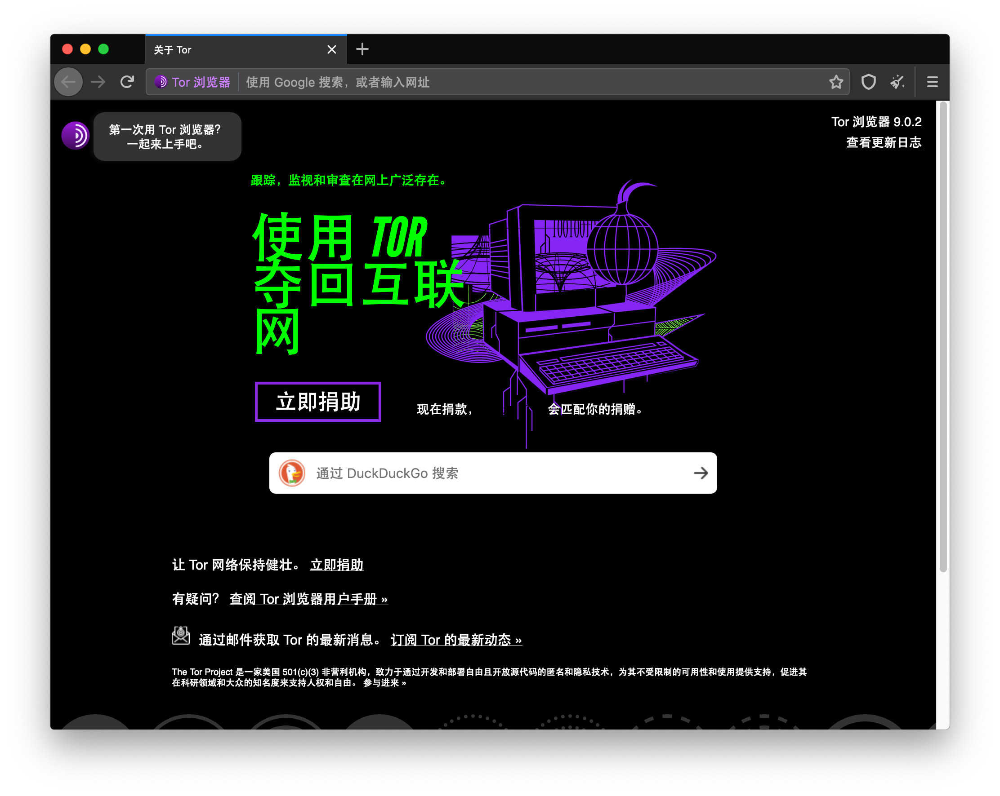
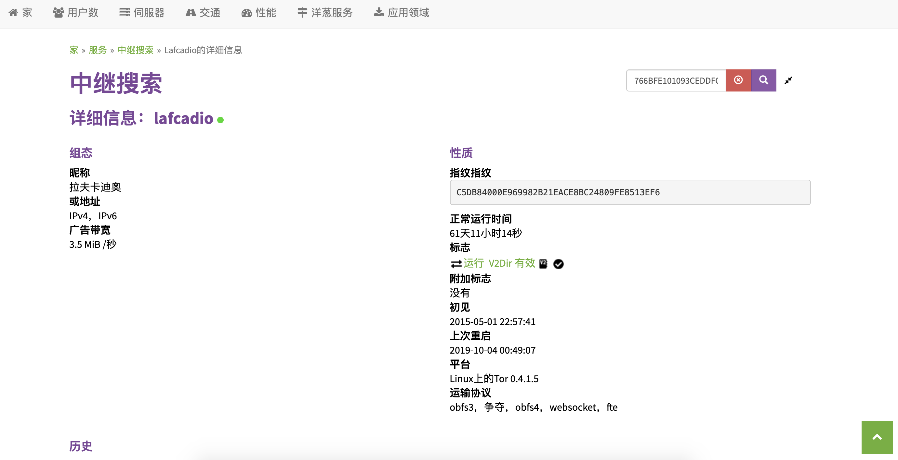

# Tor浏览器

## 简介

1. History

    ```text
    The Tor Project, Inc, became a 501(c)3 nonprofit in 2006, but the idea of "onion routing" began in the mid 1990s.

    Just like Tor users, the developers, researchers, and founders who've made Tor possible are a diverse group of people. But all of the people who have been involved in Tor are united by a common belief: internet users should have private access to an uncensored web.

    In the 1990s, the lack of security on the internet and its ability to be used for tracking and surveillance was becoming clear, and in 1995, David Goldschlag, Mike Reed, and Paul Syverson at the U.S. Naval Research Lab (NRL) asked themselves if there was a way to create internet connections that don't reveal who is talking to whom, even to someone monitoring the network. Their answer was to create and deploy the first research designs and prototypes of onion routing.

    The goal of onion routing was to have a way to use the internet with as much privacy as possible, and the idea was to route traffic through multiple servers and encrypt it each step of the way. This is still a simple explanation for how Tor works today.

    In the early 2000s, Roger Dingledine, a recent Massachusetts Institute of Technology (MIT) graduate, began working on an NRL onion routing project with Paul Syverson. To distinguish this original work at NRL from other onion routing efforts that were starting to pop up elsewhere, Roger called the project Tor, which stood for The Onion Routing. Nick Mathewson, a classmate of Roger's at MIT, joined the project soon after.

    From its inception in the 1990s, onion routing was conceived to rely on a decentralized network. The network needed to be operated by entities with diverse interests and trust assumptions, and the software needed to be free and open to maximize transparency and separation. That's why in October 2002 when the Tor network was initially deployed, its code was released under a free and open software license. By the end of 2003, the network had about a dozen volunteer nodes, mostly in the U.S., plus one in Germany.

    Recognizing the benefit of Tor to digital rights, the Electronic Frontier Foundation (EFF) began funding Roger's and Nick's work on Tor in 2004. In 2006, the Tor Project, Inc., a 501(c)3 nonprofit organization, was founded to maintain Tor's development.

    In 2007, the organization began developing bridges to the Tor network to address censorship, such as the need to get around government firewalls, in order for its users to access the open web.

    Tor began gaining popularity among activists and tech-savvy users interested in privacy, but it was still difficult for less-technically savvy people to use, so starting in 2005, development of tools beyond just the Tor proxy began. Development of Tor Browser began in 2008.

    With Tor Browser having made Tor more accessible to everyday internet users and activists, Tor was an instrumental tool during the Arab Spring beginning in late 2010. It not only protected people's identity online but also allowed them to access critical resources, social media, and websites which were blocked.

    The need for tools safeguarding against mass surveillance became a mainstream concern thanks to the Snowden revelations in 2013. Not only was Tor instrumental to Snowden's whistleblowing, but content of the documents also upheld assurances that, at that time, Tor could not be cracked.

    People's awareness of tracking, surveillance, and censorship may have increased, but so has the prevalence of these hindrances to internet freedom. Today, the network has thousands of relays run by volunteers and millions of users worldwide. And it is this diversity that keeps Tor users safe.

    We, at the Tor Project, fight every day for everyone to have private access to an uncensored internet, and Tor has become the world's strongest tool for privacy and freedom online.

    But Tor is more than just software. It is a labor of love produced by an international community of people devoted to human rights. The Tor Project is deeply committed to transparency and the safety of its users.
    ```

## 安装步骤

1. 下载tor浏览器，_注意: 在国内需要VPN_
2. 使用网桥连接，由于tor项目在国内使用是有限制的，打开后直接连接无法使用
3. 网桥有两种，一种是官方的，一种是自己搭建的
   1. 官方网桥，在国内azure的暂时可用，但是速度和成功率都不是很高
   2. 自己搭建，一般人不会尝试，但是世界上总有些不一般的人，可用通过这个[网站](https://bridges.torproject.org/)获取合适的网桥，貌似需要VPN
4. 配置成功

## 网桥测速

1. 打开[中继搜索](https://metrics.torproject.org/rs.html)
2. 输入IP地址和端口号之后的字段，搜索
3. 大致结果

## 使用注意

1. 对于一些风控好的网站，tor浏览器所发送的流量可能会被屏蔽或者被认为是robot
2. tor使用的线路大多数都来源于志愿者所贡献的带宽，所以整体的网络速度并不是很快，所及时在tor浏览器下可用脱离一些限制，但是不应该长时间占用过多的带宽
3. 网桥备份

   ```bash
    obfs4 94.242.249.2:60110 766BFE101093CEDDFC10997AED7233D5B5915350 cert=Ul7bSCEpXfyXS5JXowszb4X/Ta/pujVXU/goHK5qhHDl3oahMpJyBJyjZhDg/QWbbg6yTQ iat-mode=0
    obfs4 90.32.255.189:38050 89F669CE7B9174430DB5C40667F836D90231C7D3 cert=2KUPWgHeo4VKAs4i8Y2fov+wH8ZIhsd0AUubDr9p0VFRfZJifbzZww7tt+kVoIsBdTXHNA iat-mode=0
    obfs4 185.141.27.70:33119 CDDA4E50F65E09CC0EA58808B8E9D0A26278F2B3 cert=lFCzzNYmnL6AA7zdPBqQSLIJzCjvTeVEVrI0rL4kJFmQYIIzlSB1N2LwkPt5Yq0jpq6rLA iat-mode=0
    ```
