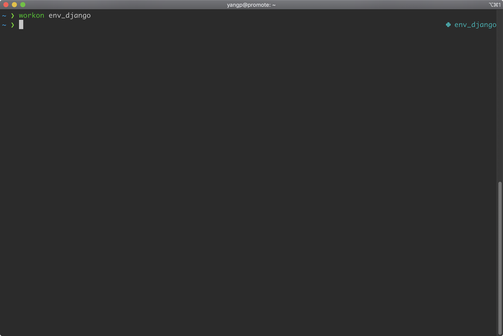
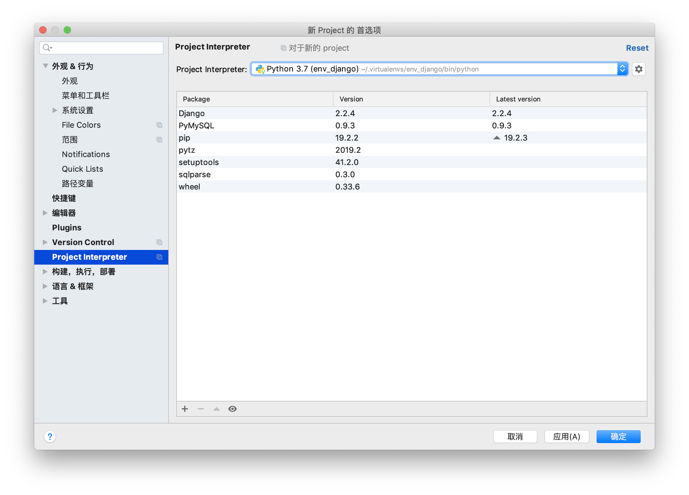

# 在Mac OS上安装python3虚拟环境

注意：_前提已经安装python3环境_

## 使用pip3安装virtualenv和virtualenvwrapper

```bash
pip3 install virtualenv virtualenvwrapper
```

## 在bash或者zsh中配置virtualenvwrapper

- 在主目录下的.bashrch或.zshrc中添加

```bash
vim ~/.zshrc
添加以下内容
export WORKON_HOME=$HOME/.virtualenvs
export VIRTUALENVWRAPPER_PYTHON=/usr/local/bin/python3
plugins=(
  virtualenvwrapper
  ）
```

- 保存退出后在终端运行`source ./zshrc`

## 注意：virtualenvwprapper.sh在items2中报错问题

1. 第一种方案：将python的变成python3，如下

  ```bash
    vim /usr/local/bin/virtualenvwrapper.sh +50
    # 修改为python3
    48 if [ "${VIRTUALENVWRAPPER_PYTHON:-}" = "" ]
    49 then
    50     VIRTUALENVWRAPPER_PYTHON="$(command \which python3)"
    51 fi
  ```

2. 第二种方案：通过.zshrc或.bashrc中设置VIRTUALENVWRAPPER_PYTHON（推荐方案）

  ```bash
  vim ~/.zshrc
  # 添加以下内容
  export WORKON_HOME=$HOME/.virtualenvs
  export VIRTUALENVWRAPPER_PYTHON=/usr/local/bin/python3
  ```

## virtualenv使用

- 常用命令如下

```bash
mkvirtualenv env_name # 创建虚拟环境
sourec env_name/bin/activate  # 开启虚拟环境
deactivate # 退出
lsvirtualenv # 列出所有虚拟环境
worken [env_name] # 切换和启动虚拟环境
rmvirtualenv # 删除虚拟环境
```

- 在命令行中使用


- 在PyCharm中使用

